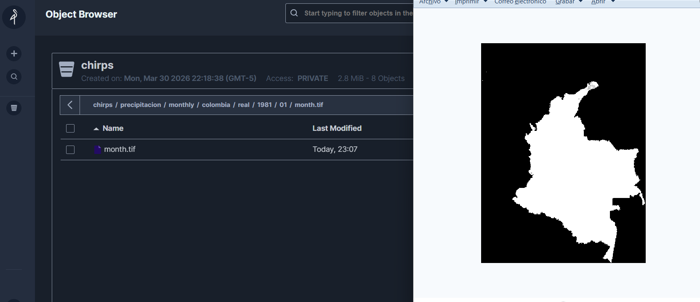

# CHIRPS Ingestor

Pipeline de ingesta de datos de precipitación CHIRPS. Descarga archivos GeoTIFF desde el servidor público de UCSB, los corta por el shapefile de cada país y los almacena en MinIO, organizados por temporalidad, país y fecha. Registra cada archivo procesado en MongoDB para que en ejecuciones posteriores solo descargue lo que falta.

---

## Resultado

`chirps/precipitacion/monthly/colombia/real/1981/01/month.tif` almacenado en MinIO tras la primera ejecución de prueba:



---

## Arquitectura

```
chirps-ingestor/
├── chirps_ingestor/
│   ├── domain/           # Modelos y puertos (interfaces)
│   ├── application/      # Orquestador + batch processor
│   ├── infrastructure/
│   │   ├── scraper/      # Scrapers Selenium (daily, pentad, dekad, monthly)
│   │   ├── geo/          # Descarga via Chrome + corte rasterio
│   │   ├── storage/      # Cliente MinIO
│   │   └── catalog/      # Catálogo MongoDB
│   └── countries/        # Configuración por país (Colombia, México, Perú)
├── scripts/
│   ├── run_ingest.py           # Ingesta incremental
│   ├── run_backfill.py         # Backfill histórico por rango de años
│   ├── check_status.py         # Estado del catálogo
│   └── test_monthly_1981_01.py # Prueba e2e Colombia enero 1981
└── tests/                      # Tests unitarios (sin GDAL ni red)
```

### Flujo del pipeline

```
UCSB (Selenium scraper)
        │
        ▼
  Lista de archivos disponibles (real + prelim)
        │
        ▼
  Deduplicación → si existe en real Y prelim, REAL gana
        │
        ▼
  Comparación con catálogo MongoDB
  ├── Nuevo → procesar
  └── Prelim con versión real disponible → upgrade prelim→real
        │
        ▼
  Por cada archivo (lotes de 6):
  Chrome descarga .tif.gz → descomprime → clip por shapefile → MinIO → MongoDB
```

---

## Temporalidades soportadas

| Temporalidad | Fuente UCSB | Patrón de archivo | Path en MinIO |
|---|---|---|---|
| Monthly | `global_monthly/tifs/` | `chirps-v2.0.YYYY.MM.tif.gz` | `precipitacion/monthly/{país}/{status}/{año}/{mes}/month.tif` |
| Pentad | `global_pentad/tifs/` | `chirps-v2.0.YYYY.MM.P.tif.gz` | `precipitacion/pentad/{país}/{status}/{año}/{mes}/{P}.tif` |
| Dekad | `global_dekad/tifs/` | `chirps-v2.0.YYYY.MM.D.tif.gz` | `precipitacion/dekad/{país}/{status}/{año}/{mes}/{D}.tif` |
| Daily | `global_daily/tifs/p05/{año}/` | `chirps-v2.0.YYYY.MM.DD.tif.gz` | `precipitacion/daily/{país}/{status}/{año}/{mes}/{DD}.tif` |

Cada temporalidad se consulta en dos árboles: `real/` (datos finales) y `prelim/` (estimación satelital). El status lo determina únicamente la URL de origen.

---

## Países configurados

| País | Código | Shapefile | Bbox |
|---|---|---|---|
| Colombia | CO | `gadm41_COL_0.shp` | (-79.0, -4.5, -66.8, 13.4) |
| México | MX | `mexico.shp` | (-118.4, 14.5, -86.7, 32.7) |
| Perú | PE | `peru.shp` | (-81.4, -18.4, -68.6, -0.1) |

Los shapefiles se almacenan en MinIO bajo `chirps/shapefiles/{país}/` y se descargan automáticamente a `tmp/shapefiles/` antes del procesamiento.

---

## Requisitos

- Python 3.12
- Google Chrome instalado (Selenium usa Chrome para descargar desde UCSB)
- MinIO corriendo (local o remoto)
- MongoDB corriendo (local o remoto)

---

## Instalación

```bash
# Clonar el repo
git clone <repo-url>
cd geovisor

# Crear y activar entorno virtual con Python 3.12
py -3.12 -m venv .venv
.venv\Scripts\activate   # Windows
# source .venv/bin/activate  # Linux/Mac

# Instalar dependencias
pip install -r requirements.txt

# Configurar variables de entorno
copy .env.example .env
# Editar .env con tus datos de MinIO y MongoDB

# Crear carpeta temporal
mkdir tmp
```

---

## Uso

### Prueba rápida — Colombia mensual enero 1981

```bash
python scripts/test_monthly_1981_01.py
```

Descarga, corta y sube `precipitacion/monthly/colombia/real/1981/01/month.tif` a MinIO.

### Ingesta incremental

```bash
# Todos los países, todas las temporalidades
python scripts/run_ingest.py

# Solo Colombia, solo mensual
python scripts/run_ingest.py --countries colombia --temporalities monthly

# Pentadal y dekadal para México y Perú
python scripts/run_ingest.py --countries mexico peru --temporalities pentad dekad
```

### Backfill histórico

```bash
python scripts/run_backfill.py --countries colombia --start-year 2015 --end-year 2024
python scripts/run_backfill.py --temporalities monthly --start-year 1981 --end-year 2024
```

### Ver estado del catálogo

```bash
python scripts/check_status.py
python scripts/check_status.py --country colombia --temporality monthly
```

### Tests unitarios (sin GDAL ni red)

```bash
pytest tests/ -v
```

---

## Variables de entorno

| Variable | Default | Descripción |
|---|---|---|
| `MONGODB_URL` | `mongodb://localhost:27017` | URL de conexión MongoDB |
| `MONGODB_DB` | `chirps_catalog` | Nombre de la base de datos |
| `MINIO_URL` | `localhost:9000` | Endpoint MinIO |
| `MINIO_USER` | `chirps_admin` | Usuario MinIO |
| `MINIO_PASSWORD` | `chirps_local_pass` | Contraseña MinIO |
| `MINIO_BUCKET` | `chirps` | Bucket de almacenamiento |
| `MINIO_SECURE` | `false` | Usar HTTPS |
| `BATCH_SIZE` | `6` | Archivos por lote |
| `RATE_LIMIT_SECONDS` | `2` | Pausa entre descargas |

---

## Infraestructura local con Docker

```bash
# Levantar MinIO + MongoDB
docker compose up -d mongo minio minio-init

# MinIO console: http://localhost:9001
# usuario: chirps_admin / contraseña: chirps_local_pass
```

---

## Convención de commits

```
feat(scope):     nueva funcionalidad
fix(scope):      corrección de bug
chore(scope):    configuración, dependencias
test(scope):     tests
refactor(scope): refactoring sin cambio de comportamiento
docs:            documentación

Scopes: domain, countries, scraper, geo, storage, catalog, app, scripts
```
